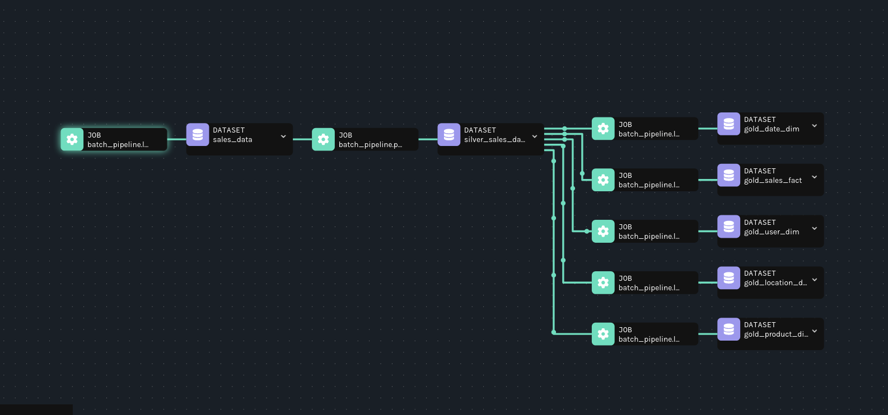
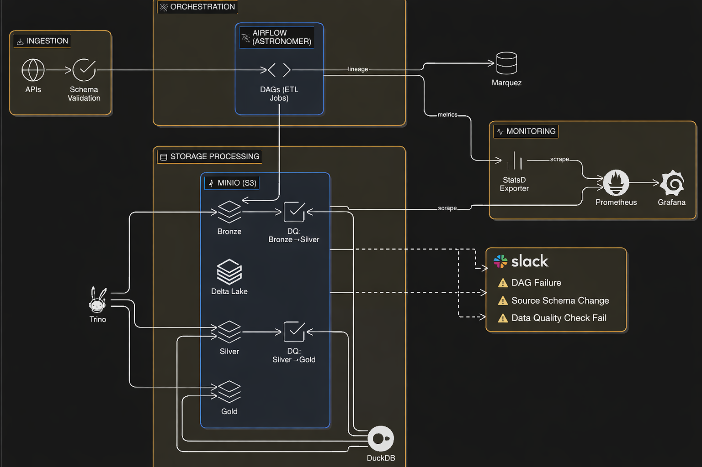

# 🚀 Random Batch Pipeline
A local batch data pipeline built with **Apache Airflow** (via Astronomer), **MinIO**, **Trino**, **Grafana**, **Prometheus**, **DuckDB** , **Delta lake** and **Marquez** — all orchestrated with **Docker Compose**. The pipeline follows the **Medallion Architecture** (Bronze → Silver → Gold), incorporates dedicated data quality validation phases at bronze and  silver layers, and comes with full monitoring and alerting capabilities out of the box.



---

## 🏗️ Architecture
```
Airflow (Astronomer)
     │
     ├── DAGs (ETL jobs)
     │
     ▼
  MinIO (S3-compatible object storage)
     │
     ▼
  Trino (distributed SQL query engine)
     │
     ▼
  Grafana ◄── Prometheus ◄── StatsD Exporter
                                    ▲
                              Airflow metrics

  Marquez (data lineage & metadata)
```

---

## 🛠️ Tech Stack

| Component | Role | Port |
|---|---|---|
| Apache Airflow (Astronomer) | Workflow orchestration | `8080` |
| MinIO | S3-compatible object storage | `9000` / `9001` |
| Trino | Distributed SQL query engine | `8082` |
| Grafana | Metrics dashboards | `3000` |
| Prometheus | Metrics collection | `9090` |
| StatsD Exporter | Airflow metrics bridge | `9102` / `9125` |
| Marquez | Data lineage tracking | `5000` / `5001` |
| Marquez Web UI | Lineage visualization | `3001` |
| PostgreSQL | Airflow metadata DB | `5432` |

---

## 📁 Project Structure

```
random-batch-pipeline/
├── dags/                        # Airflow DAG definitions
├── docker/
│   ├── grafana/                 # Grafana image & provisioning config
│   ├── minio/                   # MinIO custom image
│   ├── prometheus/              # Prometheus config
│   ├── statsd/                  # StatsD exporter mappings
│   └── trino/                   # Trino catalog & init SQL
├── include/                     # Additional project files
├── plugins/
│   └── operators/               # Custom Airflow operators
├── tests/
│   └── dags/                    # DAG unit tests
├── Dockerfile                   # Astro Runtime image
├── docker-compose.override.yml  # Extra services (MinIO, Trino, etc.)
├── makefile                     # Dev shortcuts
├── packages.txt                 # OS-level dependencies
└── requirements.txt             # Python dependencies
```

---

## ⚡ Prerequisites

- [Docker](https://docs.docker.com/get-docker/) & Docker Compose
- [Astronomer CLI](https://www.astronomer.io/docs/astro/cli/install-cli) (`astro`)
- `make`

---

## 🚀 Getting Started

### 1. Clone the repository

```bash
git clone https://github.com/Amir2402/random-batch-pipeline.git
cd random-batch-pipeline
```

### 2. Create a `.env` file

```bash
# Example .env
BRONZE_LAYER=
SILVER_LAYER=
GOLD_LAYER=
S3_ENDPOINT=
AWS_ACCESS_KEY=
AWS_SECRET_KEY=
REGION_NAME=
S3_ENDPOINT_DUCKDB=
API_URL=
SALES_DATA=
SLACK_API_KEY=
CHANNEL_ID=
RANDOM_USER_API=
RANDOM_USER_API_KEY=
```

### 3. Start the stack

```bash
make up
```

This command will:
1. Build all custom Docker images (MinIO, Grafana, Trino, Prometheus, StatsD Exporter)
2. Start Airflow and all supporting services via `astro dev start`
3. Run Trino's table initialization SQL

### 4. Stop the stack

```bash
make down
```

### 5. Restart

```bash
make restart
```

---

## 🌐 Service URLs

| Service | URL | Credentials |
|---|---|---|
| Airflow UI | http://localhost:8080 | `admin` / `admin` |
| MinIO Console | http://localhost:9001 | `admin` / `admin123` |
| Trino UI | http://localhost:8082 | — |
| Grafana | http://localhost:3000 | `admin` / `admin` |
| Prometheus | http://localhost:9090 | — |
| Marquez API | http://localhost:5000 | — |
| Marquez Web UI | http://localhost:3001 | — |

> **Note:** If any ports are already in use on your machine, refer to the [Astronomer troubleshooting docs](https://www.astronomer.io/docs/astro/cli/troubleshoot-locally#ports-are-not-available-for-my-local-airflow-webserver).